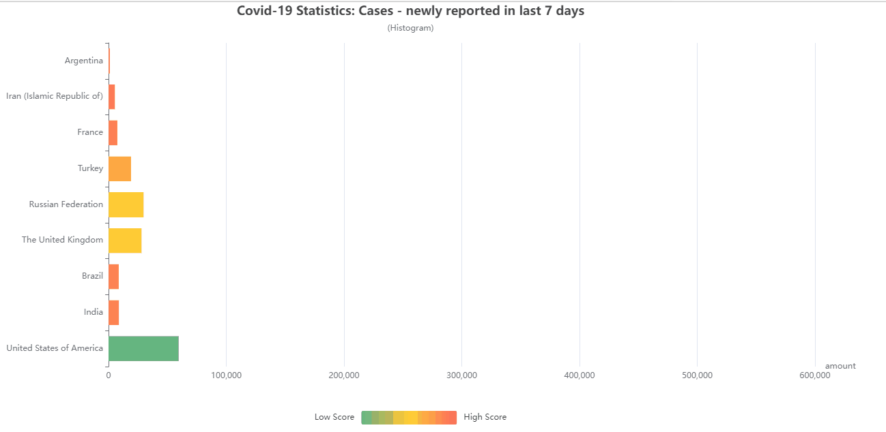
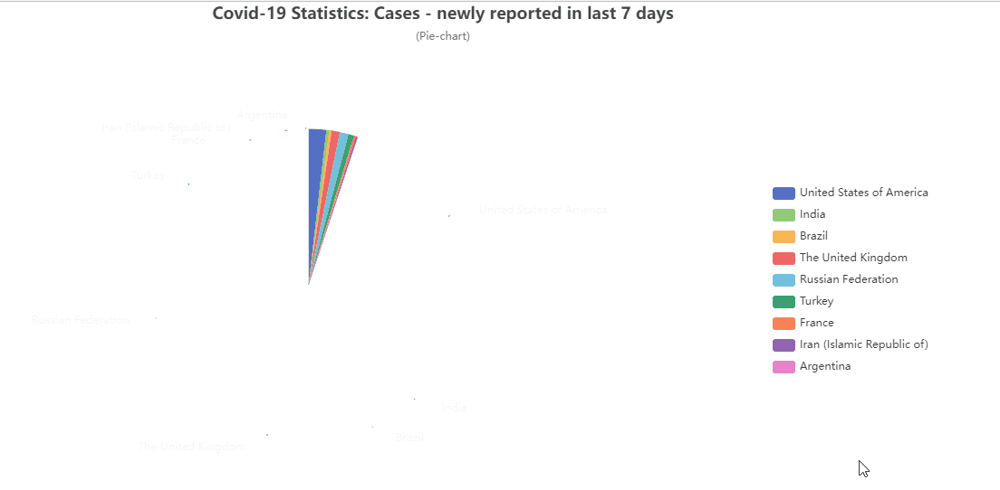
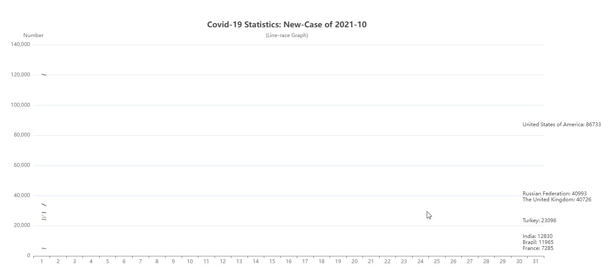

# CS 209A 项目

## 总览

数据可视化是在一种在可视化技术帮助下洞见数据特征的艺术，例如：使用表格、图像或者形式更加复杂的可视化手段如仪表盘。

现在，新冠疫情依旧在全球蔓延，我们可以很容易地获得大量相关的统计数据。我们的任务是实现这些数据的可视化，以便于更好地分析这些数据。在这次项目中，你需要用 *Java* 实现像数据获取和分析这样的后端任务，当然，你可以使用任何程序设计语言（如，*Java*, *jsp*, *html*, *js*, *css*...）

这里提供了一个基本的数据文件 `owid-covid-data.csv`, 你也可以在 http://github.com/owid/covid-19-data 网站上下载它。

请根据下列要求实现数据可视化。

## 基本要求

1. 使用一个合理的数据组织形式来存储数据。

2. 在一个视图中呈现所有数据。

3. 使用 2 种以上的图表展现不同的分析结果。比如，通过不同的图表展示各城市的死亡人数和确认病例。
   比方说：

   
   

4. 报告。

## 进阶要求

1. 自动追踪最新的疫情数据。要从实时更新的网站里获取最新数据哦！
2. 提供自定义的数据源。
3. 在视图里提供一个查找功能，你可以展示搜索和筛选的结果和回退到原始的结果，或者高亮前面的搜索结果。
4. 在视图里提供一个排序功能，比如，根据时间、国家和（死掉的）人数排序。
5. 使用其他的可视化方式，比如，图、映射表、动态图. 
6. 可持久化数据。
7. 通过设置平滑参数，调整展现出来的图像。
8. 用动画展现趋势。

例如：




## 评价标准

基本功能，60 分。

进阶功能：（总分40分）

1. 自动跟踪最新的疫情数据（+5）
2. 多数据源（+5）
3. 搜索功能（+5）
4. 排序功能（+5）
5. map 可视化（+10），其他可视化（+5）
6. 存档（+5），存图（+5）
7. 可变参数与数据调整（+5）
8. 动画展示趋势（+5），设置进度条以实现快进、暂停、回退（+5）

## 报告

项目是开放性的，所以你得提交一个展示你的成果内容的报告。

最好包括这些内容：

- 项目文件结构，`tree` 命令可以快速生成它。
- 自定义类的成员变量与方法解释。
- 程序的示范（可以考虑截图）

## 提交

请提交两部分东西。

1. 整个项目文件
2. 报告文件

你必须将文件压缩好，并命名为 `StudentID-Name-Project.zip`. 

另外，如果你可以在第 15 周展示你的项目，你可以得到 5 points. 

而且，如果你的项目能被选择在理论课被展示，可以得到 5 ~ 15 points. 

## 资源

WTO COVID-19 Dashboard: https://covid19.who.int/

WTO COVID-19 Data table: https://covid19.who.int/table

## 基本数据文件相关信息

### 原始信息

#### 国家基本信息

iso_code: ISO country code, 国家代码

continent: 所属大洲

location: 国家或地区

date: 日期

population: 人口总数（人）

population_density: 人口密度

stringency_index: 财政紧缩指数

life_expectancy: 平均寿命（岁）

median_age: 年龄中位数？**//todo**

human_development_index: 人类发展指数

aged_65_older: 65岁以上人数比例

aged_70_older: 70岁以上人数比例

gdp_per_capita: 人均国内生产总值

extreme_poverty: 极端贫穷

handwashing_facilities: 卫生设施

hospital_beds_per_thousand: 医院床位（每1000个医院）？**//todo**

cardiovasc_death_rate: 心血管的死亡率？**//todo**

diabetes_prevalence: 糖尿病患病率

female_smokers: 女性吸烟人数（人）

male_smokers: 男性吸烟人数（人）

#### 疫情相关信息

**以下以「人」为单位：**

total_cases: 总感染病例

total_deaths: 总死亡病例

icu_patients: 进入 ICU 的病例数

hosp_patients: 入院病例数

weekly_icu_admissions: 周进入 ICU 病例数

new_tests: 检测数

total_vaccinations: 接种疫苗数

total_boosters_per_hundred: （疫苗）加强针接种数

excess_mortality_cumulative: 超额死亡累计数

**以下为比例：**

reproduction_rate: 基本传染数，基本再生数。

Tip: 指没有任何防疫作为介入且所有人没有免疫力情况下，一个感染到某种传染病的初发个案，能够把疾病传染给其他多少个人的平均数。
基本传染数通常写作 $R_0$ . 容易发现，该值愈大，即流行病愈难控制。
在没有防疫情况下：

- 若 $R_0 < 1$, 该传染病将逐渐消失。
- 若 $R_0 > 1$, 该传染病会以指数方式散步，成为流行病。
- 若 $R_0 = 1$, 传染病会变成地方性流行病

positive_rate: （检测）阳性率

**其他：**

tests_units: 统计检测次数的单位

### 附加信息

**以下以「人」为单位：**

new_cases: 新增感染病例

new_deaths: 新增死亡病例

total_cases_per_million: 每100万人中的总感染病例

new_cases_per_million: 每100万人中的新增感染病例

total_deaths_per_million: 每100万人中的总死亡病例

new_deaths_per_million: 每100万人中的新增死亡病例

excess_mortality_cumulative_absolute: 超额死亡累计数绝对值

excess_mortality_cumulative_per_million: 每100万人的超额死亡累计数

**以下为比例：**

excess_mortality: 超额死亡率

new_cases_smoothed: 

new_deaths_smoothed: 降噪？**//todo**

new_cases_smoothed_per_million: **//todo**

new_deaths_smoothed_per_million: **//todo**

## 注释规范

在代码中，使用 *JavaDoc* 注释应遵循如下的规范：

- 使用 `/**` 开头，以显式描述该类、方法、成员变量的作用，注释应当写在其解释的对象之前。
- 注释过程中，一般的断句不应该出现换行。任何显示的换行操作前先写下如下代码 `<br>`, 以让支持 html 渲染的设备能够意识到这里进行了显示的换行声明。
- 通过 `<p>` 进行分段，笔者建议在段落结束时直接增加一段 `<p/>` 进行分段。
- 注释的内容应当有一定的层次感，目前大致建议分成两部分，一部分是对象注释头部，概述该对象的用处；后一部分是对该对象用法的详细解释，建议对于具体的方法有足够详细的描述，以便于让调用者知道该方法的用处和（如果有的话）副作用。可以通过 `<blockquote> ... </blockquote>` 增加代码样例以便于使用者增进理解，和增加字数。
- 通过 `{@link package.class(#method/member variable)}` 能够创建一个指向其他类、方法、属性的超链接，以便于调用者增进理解。
- `@see` 注解能够在注释的尾部增加一段参考说明，语义大概同一篇论文的参考文章条目。
- `@deprecated` 表示该方法不推荐使用，将在未来弃用。（这实际上是一种对过去作出承诺的背弃，请不要轻易做出这个决定。）

以下是关于枚举类 `Continent` 的注释，仅供参考：

```java
/**
 * 七大洲<br>
 * <p/>
 *
 * 一个包含了七大洲（亚洲、欧洲...）的枚举类。<br>
 * <p/>
 *
 * 调用 {@link Continent#valueOf(String)} 能够直接获得相应的枚举实例。<br>
 * 例如：<br>
 * <blockquote>
 *     Continent africa = Continent.valueOf("AFRICA");
 * </blockquote>
 * <p/>
 *
 * 调用该方法需要传递相关的对应的枚举实例全名，而不是缺省值、或者其他语言下的翻译。<br>
 * 如果尝试写出以下代码：<br>
 * <blockquote>
 *     Continent 亚洲 = Continent.valueOf("亚洲");
 * </blockquote>
 * 则会得到一个参数不合法的异常回馈：{@link IllegalArgumentException}.
 * <p/>
 *
 * 在 tool 包中提供了一个特殊的解释器实例 {@link tool.Explainer}, 它将提供重载的解释方法 {@link tool.Explainer#getName(Continent)} 用户获取对应语言下的实例解释。<br>
 * <p/>
 *
 * @see tool.Explainer
 */
```


---

*Fri Nov 26 21:57:20 CST 2021*

新增三个特殊的关键字（identifier）对方法进行描述：**构造器**，**更改器**，**访问器**。

- **更改器**方法：该方法将会直接、间接更改其对象的内部信息或行为。
- **访问器**方法：该方法不会更改调用对象的任何信息。
- **构造器**方法：对于不可变对象而言，通过构造一个新的对象来传达「改变」 的信息。

## 接口规范

---

*Sun Nov 28 21:40:21 CST 2021*

添加了一个特殊的数据对象 `data.Data`. 

- 类 `data.Data` 提供了关键字如下的唯一接口：`String fetch(String property)`. 
  具体约定如下：
  - 输入与列名相同的 property 以便获取对象实例的具体属性值。出于方便起见，匹配过程中模糊大小写和下划线/空格符的区别。
  - 如果该对象不存在对应的属性，则返回 `null`, 否则不会返回 `null`. 
- 新增了工具类 `tool.Tool`, 提供了获取文件中 Data 的方法 `List<data.Data> readDataFile(java.io.File file)` 获取文件中所有的数据并汇总成列表。

---

*Thu Dec 9 20:17:59 CST 2021*

添加了一个全局的数据管理接口：`tool.Controller`. 

类 `tool.Controller` 是一个没有扩展性的一个特殊类，专门负责管理我们当前持有的数据。

如果数据列相同，它支持提供更复杂的多源数据内容管理！但它并不支持完全不同的数据表格的数据管理。（或者说，支持的并不好！）

它通过 `tool.Tool` 里的 `hashFileInSHA1` 方法对待查找的函数进行哈希值的计算，并藉此来确定该文件是否被成功读取进文件中。这可以尽可能地减少重复读取文件的可能发生。

*:warning: ​Warning: Sometimes the different files would have the same hash value, but I did not compare them...* 

Controller 使用了基于贪心创建的单例模式，通过全局静态变量 `tool.Controller.instance` 去获取全局唯一的对象并使用。

其对象拥有特殊的成员方法：`getFileData` 将会返回一个 `FileController` 实例，该实例负责承载所有该文件中的数据信息。

另外，类 FileController 的构造器是包可见的，这意味着你不能通过该方法以外的任何方法获取它的实例。

关于 FileController, 其拥有四个公开访问权限的属性：平凡属性行信息，平凡属性列名；高级属性行信息，高级属性行名。

使用**公开访问权限**的意义是，提醒使用者需要自行注意使用无副作用的操作或提前克隆副本以避免污染数据源——一旦程序运行起来，它不会二次读入同一个文件的相关信息。

通过方法访问往往会引起歧义！

## 图形界面规范

---

*Tue Dec 7 15:14:14 CST 2021*

新添加了相关的图像处理样例，以便于更好地实现 GUI 显示。

- 新增了 class Launch01, 测试了条形统计图自带的动画效果。
- 新增了 class Launch02, 测试了折线图自带的动画效果。
- 新增了 class Launch03, 测试了折线图与滑动条的联动效果。
- 新增了 class Launch4PopStage, 测试了定时弹窗窗口的实现情形。
- 新增了 class Launch4BallBounce, 测试了简单动画（非即时计算）的效果。


todo: 还需要处理的问题：

- [ ] 实现弹窗的动画特效。
- [ ] 研究即时计算的动画效果。

---

*Tue Dec 7 23:10:38 CST 2021*

新添加了提示框的处理样例，以便于更好地提醒用户使用 GUI. 

- 新增了 class Launch4TipBar, 测试了提示框的显示功能。
- 调整了 class view2.Launch 的相关内容，以便于能够自动从列信息中导出所需要的信息。

---

*Thu Dec 9 20:00:58 CST 2021*

调整了 GUI 的相关设定。

- 新增了提示框出现、消失的动画，并处理了相关的 BUG. 现在可以通过 <kbd>alt</kbd>/<kbd>option</kbd> + <kbd>T</kbd> 快速执行该动画。


## 图表类型：

### 表：

1. 国家基本信息表
2. 新冠数据表

### 图：

1. 条形图：

   x轴：国家

   y轴：total cases, new cases, total deaths等，用户可以在界面中自选

   动态：选择某日期或日期区间

2. 饼图：

   国家之间的比较

   比较内容：total cases, new cases, total deaths等，用户可以在界面中自选

   动态：选择某日期或日期区间

3. 折线图：

   x轴：日期

   y轴：国家，用户可以在界面中自选显示哪些国家

   动态：选择某日期或日期区间
